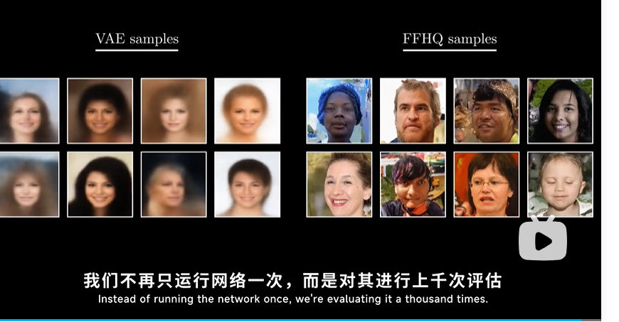

# 6-8训练

D:\DDPM\.venv\Scripts\python.exe D:\DDPM\DDPM_traning.py
Epoch 1/100: 100%|██████████| 1875/1875 [08:24<00:00,  3.72it/s, loss=0.0156]
Epoch [1/100], Loss: 0.024802
第 1 个 epoch 的生成监控图已保存到：outputs/monitor_samples/epoch_001.png
Epoch 2/100: 100%|██████████| 1875/1875 [08:18<00:00,  3.76it/s, loss=0.0136]
Epoch 3/100:   0%|          | 0/1875 [00:00<?, ?it/s]Epoch [2/100], Loss: 0.011913
Epoch 3/100: 100%|██████████| 1875/1875 [08:18<00:00,  3.76it/s, loss=0.00595]
Epoch [3/100], Loss: 0.011472
Epoch 4/100: 100%|██████████| 1875/1875 [08:18<00:00,  3.76it/s, loss=0.0123]
Epoch 5/100:   0%|          | 0/1875 [00:00<?, ?it/s]Epoch [4/100], Loss: 0.010823
Epoch 5/100: 100%|██████████| 1875/1875 [08:18<00:00,  3.76it/s, loss=0.00799]
Epoch 6/100:   0%|          | 0/1875 [00:00<?, ?it/s]Epoch [5/100], Loss: 0.010556
Epoch 6/100: 100%|██████████| 1875/1875 [08:18<00:00,  3.76it/s, loss=0.00886]
Epoch [6/100], Loss: 0.010516
Epoch 7/100: 100%|██████████| 1875/1875 [08:18<00:00,  3.76it/s, loss=0.0111]
Epoch 8/100:   0%|          | 0/1875 [00:00<?, ?it/s]Epoch [7/100], Loss: 0.010288
Epoch 8/100: 100%|██████████| 1875/1875 [08:18<00:00,  3.76it/s, loss=0.00899]
Epoch 9/100:   0%|          | 0/1875 [00:00<?, ?it/s]Epoch [8/100], Loss: 0.010119
Epoch 9/100: 100%|██████████| 1875/1875 [08:18<00:00,  3.76it/s, loss=0.00487]
Epoch 10/100:   0%|          | 0/1875 [00:00<?, ?it/s]Epoch [9/100], Loss: 0.010233
Epoch 10/100: 100%|██████████| 1875/1875 [08:18<00:00,  3.76it/s, loss=0.00958]
Epoch [10/100], Loss: 0.009971
epoch为9时权重中途已保存
第 10 个 epoch 的生成监控图已保存到：outputs/monitor_samples/epoch_010.png
Epoch 11/100: 100%|██████████| 1875/1875 [08:17<00:00,  3.77it/s, loss=0.01]
Epoch 12/100:   0%|          | 0/1875 [00:00<?, ?it/s]Epoch [11/100], Loss: 0.009999
Epoch 12/100: 100%|██████████| 1875/1875 [08:17<00:00,  3.77it/s, loss=0.0104]
Epoch 13/100:   0%|          | 0/1875 [00:00<?, ?it/s]Epoch [12/100], Loss: 0.009777
Epoch 13/100: 100%|██████████| 1875/1875 [08:17<00:00,  3.77it/s, loss=0.00612]
Epoch 14/100:   0%|          | 0/1875 [00:00<?, ?it/s]Epoch [13/100], Loss: 0.009964
Epoch 14/100: 100%|██████████| 1875/1875 [08:17<00:00,  3.77it/s, loss=0.00917]
Epoch 15/100:   0%|          | 0/1875 [00:00<?, ?it/s]Epoch [14/100], Loss: 0.009837
Epoch 15/100: 100%|██████████| 1875/1875 [08:17<00:00,  3.77it/s, loss=0.00982]
Epoch 16/100:   0%|          | 0/1875 [00:00<?, ?it/s]Epoch [15/100], Loss: 0.009822
Epoch 16/100: 100%|██████████| 1875/1875 [08:17<00:00,  3.77it/s, loss=0.00691]
Epoch 17/100:   0%|          | 0/1875 [00:00<?, ?it/s]Epoch [16/100], Loss: 0.009859
Epoch 17/100: 100%|██████████| 1875/1875 [08:17<00:00,  3.77it/s, loss=0.00955]
Epoch 18/100:   0%|          | 0/1875 [00:00<?, ?it/s]Epoch [17/100], Loss: 0.009790
Epoch 18/100: 100%|██████████| 1875/1875 [08:17<00:00,  3.77it/s, loss=0.0146]
Epoch 19/100:   0%|          | 0/1875 [00:00<?, ?it/s]Epoch [18/100], Loss: 0.009696
Epoch 19/100: 100%|██████████| 1875/1875 [08:17<00:00,  3.77it/s, loss=0.011]
Epoch [19/100], Loss: 0.009673
Epoch 20/100: 100%|██████████| 1875/1875 [08:17<00:00,  3.77it/s, loss=0.00979]
Epoch [20/100], Loss: 0.009760
epoch为19时权重中途已保存
Epoch 21/100:   0%|          | 0/1875 [00:00<?, ?it/s]第 20 个 epoch 的生成监控图已保存到：outputs/monitor_samples/epoch_020.png
Epoch 21/100: 100%|██████████| 1875/1875 [08:21<00:00,  3.74it/s, loss=0.0113]
Epoch 22/100:   0%|          | 0/1875 [00:00<?, ?it/s]Epoch [21/100], Loss: 0.009705
Epoch 22/100: 100%|██████████| 1875/1875 [08:22<00:00,  3.73it/s, loss=0.0131]
Epoch 23/100:   0%|          | 0/1875 [00:00<?, ?it/s]Epoch [22/100], Loss: 0.009581
Epoch 23/100: 100%|██████████| 1875/1875 [08:23<00:00,  3.72it/s, loss=0.00488]
Epoch 24/100:   0%|          | 0/1875 [00:00<?, ?it/s]Epoch [23/100], Loss: 0.009679
Epoch 24/100: 100%|██████████| 1875/1875 [08:23<00:00,  3.72it/s, loss=0.00791]
Epoch 25/100:   0%|          | 0/1875 [00:00<?, ?it/s]Epoch [24/100], Loss: 0.009658
Epoch 25/100: 100%|██████████| 1875/1875 [08:23<00:00,  3.73it/s, loss=0.00814]
Epoch 26/100:   0%|          | 0/1875 [00:00<?, ?it/s]Epoch [25/100], Loss: 0.009560
Epoch 26/100: 100%|██████████| 1875/1875 [08:23<00:00,  3.72it/s, loss=0.00962]
Epoch 27/100:   0%|          | 0/1875 [00:00<?, ?it/s]Epoch [26/100], Loss: 0.009420
Epoch 27/100: 100%|██████████| 1875/1875 [08:23<00:00,  3.73it/s, loss=0.00422]
Epoch 28/100:   0%|          | 0/1875 [00:00<?, ?it/s]Epoch [27/100], Loss: 0.009630
Epoch 28/100: 100%|██████████| 1875/1875 [08:23<00:00,  3.73it/s, loss=0.0097]
Epoch 29/100:   0%|          | 0/1875 [00:00<?, ?it/s]Epoch [28/100], Loss: 0.009516
Epoch 29/100: 100%|██████████| 1875/1875 [08:22<00:00,  3.73it/s, loss=0.00821]
Epoch 30/100:   0%|          | 0/1875 [00:00<?, ?it/s]Epoch [29/100], Loss: 0.009565
Epoch 30/100: 100%|██████████| 1875/1875 [08:23<00:00,  3.73it/s, loss=0.00963]
Epoch [30/100], Loss: 0.009656
epoch为29时权重中途已保存
第 30 个 epoch 的生成监控图已保存到：outputs/monitor_samples/epoch_030.png
Epoch 31/100: 100%|██████████| 1875/1875 [08:23<00:00,  3.73it/s, loss=0.00801]
Epoch 32/100:   0%|          | 0/1875 [00:00<?, ?it/s]Epoch [31/100], Loss: 0.009592
Epoch 32/100: 100%|██████████| 1875/1875 [08:22<00:00,  3.73it/s, loss=0.0106]
Epoch 33/100:   0%|          | 0/1875 [00:00<?, ?it/s]Epoch [32/100], Loss: 0.009342
Epoch 33/100: 100%|██████████| 1875/1875 [08:23<00:00,  3.73it/s, loss=0.0144]
Epoch [33/100], Loss: 0.009428
Epoch 34/100: 100%|██████████| 1875/1875 [08:22<00:00,  3.73it/s, loss=0.00866]
Epoch 35/100:   0%|          | 0/1875 [00:00<?, ?it/s]Epoch [34/100], Loss: 0.009469
Epoch 35/100: 100%|██████████| 1875/1875 [08:22<00:00,  3.73it/s, loss=0.00679]
Epoch 36/100:   0%|          | 0/1875 [00:00<?, ?it/s]Epoch [35/100], Loss: 0.009560
Epoch 36/100: 100%|██████████| 1875/1875 [08:22<00:00,  3.73it/s, loss=0.00905]
Epoch 37/100:   0%|          | 0/1875 [00:00<?, ?it/s]Epoch [36/100], Loss: 0.009388
Epoch 37/100: 100%|██████████| 1875/1875 [08:23<00:00,  3.72it/s, loss=0.0109]
Epoch 38/100:   0%|          | 0/1875 [00:00<?, ?it/s]Epoch [37/100], Loss: 0.009434
Epoch 38/100: 100%|██████████| 1875/1875 [08:23<00:00,  3.72it/s, loss=0.00967]
Epoch 39/100:   0%|          | 0/1875 [00:00<?, ?it/s]Epoch [38/100], Loss: 0.009331
Epoch 39/100: 100%|██████████| 1875/1875 [08:24<00:00,  3.72it/s, loss=0.0059]
Epoch 40/100:   0%|          | 0/1875 [00:00<?, ?it/s]Epoch [39/100], Loss: 0.009501
Epoch 40/100: 100%|██████████| 1875/1875 [08:24<00:00,  3.72it/s, loss=0.0127]
Epoch [40/100], Loss: 0.009383
epoch为39时权重中途已保存
第 40 个 epoch 的生成监控图已保存到：outputs/monitor_samples/epoch_040.png
Epoch 41/100: 100%|██████████| 1875/1875 [08:23<00:00,  3.72it/s, loss=0.00821]
Epoch 42/100:   0%|          | 0/1875 [00:00<?, ?it/s]Epoch [41/100], Loss: 0.009394
Epoch 42/100: 100%|██████████| 1875/1875 [08:24<00:00,  3.72it/s, loss=0.00879]
Epoch 43/100:   0%|          | 0/1875 [00:00<?, ?it/s]Epoch [42/100], Loss: 0.009404
Epoch 43/100: 100%|██████████| 1875/1875 [08:24<00:00,  3.71it/s, loss=0.00841]
Epoch [43/100], Loss: 0.009353
Epoch 44/100: 100%|██████████| 1875/1875 [08:25<00:00,  3.71it/s, loss=0.0156]
Epoch 45/100:   0%|          | 0/1875 [00:00<?, ?it/s]Epoch [44/100], Loss: 0.009277
Epoch 45/100: 100%|██████████| 1875/1875 [08:24<00:00,  3.72it/s, loss=0.00733]
Epoch 46/100:   0%|          | 0/1875 [00:00<?, ?it/s]Epoch [45/100], Loss: 0.009408
Epoch 46/100: 100%|██████████| 1875/1875 [08:24<00:00,  3.72it/s, loss=0.00945]
Epoch 47/100:   0%|          | 0/1875 [00:00<?, ?it/s]Epoch [46/100], Loss: 0.009371
Epoch 47/100: 100%|██████████| 1875/1875 [08:24<00:00,  3.72it/s, loss=0.00824]
Epoch 48/100:   0%|          | 0/1875 [00:00<?, ?it/s]Epoch [47/100], Loss: 0.009307
Epoch 48/100: 100%|██████████| 1875/1875 [08:24<00:00,  3.71it/s, loss=0.00838]
Epoch 49/100:   0%|          | 0/1875 [00:00<?, ?it/s]Epoch [48/100], Loss: 0.009455
Epoch 49/100: 100%|██████████| 1875/1875 [08:24<00:00,  3.72it/s, loss=0.00816]
Epoch 50/100:   0%|          | 0/1875 [00:00<?, ?it/s]Epoch [49/100], Loss: 0.009253
Epoch 50/100: 100%|██████████| 1875/1875 [08:23<00:00,  3.72it/s, loss=0.0128]
Epoch [50/100], Loss: 0.009335
epoch为49时权重中途已保存
第 50 个 epoch 的生成监控图已保存到：outputs/monitor_samples/epoch_050.png
Epoch 51/100: 100%|██████████| 1875/1875 [08:24<00:00,  3.71it/s, loss=0.0115]
Epoch 52/100:   0%|          | 0/1875 [00:00<?, ?it/s]Epoch [51/100], Loss: 0.009297
Epoch 52/100: 100%|██████████| 1875/1875 [08:24<00:00,  3.72it/s, loss=0.00737]
Epoch 53/100:   0%|          | 0/1875 [00:00<?, ?it/s]Epoch [52/100], Loss: 0.009352
Epoch 53/100: 100%|██████████| 1875/1875 [08:24<00:00,  3.72it/s, loss=0.0147]
Epoch 54/100:   0%|          | 0/1875 [00:00<?, ?it/s]Epoch [53/100], Loss: 0.009223
Epoch 54/100: 100%|██████████| 1875/1875 [08:24<00:00,  3.72it/s, loss=0.0115]
Epoch 55/100:   0%|          | 0/1875 [00:00<?, ?it/s]Epoch [54/100], Loss: 0.009233
Epoch 55/100: 100%|██████████| 1875/1875 [08:23<00:00,  3.72it/s, loss=0.00691]
Epoch 56/100:   0%|          | 0/1875 [00:00<?, ?it/s]Epoch [55/100], Loss: 0.009432
Epoch 56/100: 100%|██████████| 1875/1875 [08:24<00:00,  3.72it/s, loss=0.00654]
Epoch 57/100:   0%|          | 0/1875 [00:00<?, ?it/s]Epoch [56/100], Loss: 0.009388
Epoch 57/100: 100%|██████████| 1875/1875 [08:24<00:00,  3.72it/s, loss=0.0136]
Epoch 58/100:   0%|          | 0/1875 [00:00<?, ?it/s]Epoch [57/100], Loss: 0.009351
Epoch 58/100: 100%|██████████| 1875/1875 [08:29<00:00,  3.68it/s, loss=0.00951]
Epoch 59/100:   0%|          | 0/1875 [00:00<?, ?it/s]Epoch [58/100], Loss: 0.009294
Epoch 59/100: 100%|██████████| 1875/1875 [08:29<00:00,  3.68it/s, loss=0.00931]
Epoch 60/100:   0%|          | 0/1875 [00:00<?, ?it/s]Epoch [59/100], Loss: 0.009239
Epoch 60/100: 100%|██████████| 1875/1875 [08:19<00:00,  3.76it/s, loss=0.00926]
Epoch [60/100], Loss: 0.009172
epoch为59时权重中途已保存
Epoch 61/100:   0%|          | 0/1875 [00:00<?, ?it/s]第 60 个 epoch 的生成监控图已保存到：outputs/monitor_samples/epoch_060.png
Epoch 61/100: 100%|██████████| 1875/1875 [11:11:58<00:00, 21.50s/it, loss=0.00839]
Epoch [61/100], Loss: 0.009214
Epoch 62/100:   6%|▌         | 106/1875 [00:29<08:06,  3.64it/s, loss=0.0121]
Traceback (most recent call last):
  File "D:\DDPM\DDPM_traning.py", line 188, in `<module>`
    loss.backward() # 直接调用 loss.backward() 时，loss 必须是一个标量，也就是只有一个数
    ^^^^^^^^^^^^^^^
  File "D:\DDPM\.venv\Lib\site-packages\torch\_tensor.py", line 581, in backward
    torch.autograd.backward(
  File "D:\DDPM\.venv\Lib\site-packages\torch\autograd\__init__.py", line 347, in backward
    _engine_run_backward(
  File "D:\DDPM\.venv\Lib\site-packages\torch\autograd\graph.py", line 825, in _engine_run_backward
    return Variable._execution_engine.run_backward(  # Calls into the C++ engine to run the backward pass
           ^^^^^^^^^^^^^^^^^^^^^^^^^^^^^^^^^^^^^^^^^^^^^^^^^^^^^^^^^^^^^^^^^^^^^^^^^^^^^^^^^^^^^^^^^^^^^^
KeyboardInterrupt

Process finished with exit code -1073741510 (0xC000013A: interrupted by Ctrl+C)

## 关于监控图

```sql
 with torch.no_grad():
        x = torch.randn(
            n_sample_images,
            1,
            image_size,
            image_size,
            device=device,
        )
```

6-8日的版本其实这里已经是从随机噪声开始的，并不是我一开始想要的监控过程（DDPM.md里gif的动态过程，从x0生成的xt原路返回），已经是实打实的generate过程了（从纯随机开始）

# 替换数据集

```python
pretrained="mnist",  # 👈 直接指定数据集名称，库会自动在后台执行 download 并加载
model = deepinv.models.DiffUNet(
    in_channels=3,       # 👈 彩色人脸是 3 通道
    out_channels=3,
    pretrained="celeba", # 👈 自动下载并加载官方明星人脸预训练权重
).to(device)
model=deepinv.models.DiffUNet(
    in_channels=1,
    out_channels=1,
    pretrained="download"  # 替换
).to(device)
```

这是数据集应该是什么？还有up主说我们真正希望的是，既能保持这种高视觉保真度，又能在仅仅几个推理步骤中实现什么意思？

# 替换代码

```python
import deepinv
import torch
from torchvision.utils import save_image
from pathlib import Path

device = "cuda" if torch.cuda.is_available() else "cpu"

# 🚨 核心修改 1：FFHQ 官方预训练权重对应的图像尺寸（通常是 64x64 或 128x128，具体取决于库版本，这里以 64 为例）
image_size = 64  

# 一次生成的图片数量
n_samples = 16  # 人脸较大，可以适当调小一点看效果

# 扩散步数和 Beta 调度（需要匹配 deepinv 官方 FFHQ 模型的训练设置，通常默认也是 1000 步）
beta_start = 1e-4
beta_end = 0.02
timesteps = 1000

output_path = Path("outputs/samples/ffhq_generated_samples.png")

# 🚨 核心修改 2：改变输入输出通道，并指定 pretrained="ffhq"
model = deepinv.models.DiffUNet(
    in_channels=3,     # 👈 FFHQ 是 RGB 彩色图，必须是 3 通道
    out_channels=3,    # 👈 输出也必须是 3 通道
    pretrained="ffhq", # 👈 告诉 deepinv 自动从云端下载并导入 FFHQ 的官方预训练权重
).to(device)

model.eval()

# 构造反向采样公式需要的系数表
betas = torch.linspace(beta_start, beta_end, timesteps, device=device)
alphas = 1.0 - betas
alphas_cumprod = torch.cumprod(alphas, dim=0)

# 采样阶段（Up主说的：这一段核心去噪逻辑完全不需要变）
with torch.no_grad():
    # 🚨 核心修改 3：从 3 通道的纯高斯噪声开始 [n_samples, 3, 64, 64]
    x = torch.randn(n_samples, 3, image_size, image_size, device=device)

    for t in reversed(range(timesteps)):
        t_tensor = torch.full((n_samples,), t, device=device, dtype=torch.long)
        predicted_noise = model(x, t_tensor, type_t="timestep")

        alpha = alphas[t]
        alpha_cumprod = alphas_cumprod[t]
        beta = betas[t]

        if t > 0:
            noise = torch.randn_like(x)
        else:
            noise = 0

        # DDPM 反向采样公式不变
        x = (
            (1 / torch.sqrt(alpha))
            * (x - (beta / torch.sqrt(1 - alpha_cumprod)) * predicted_noise)
            + torch.sqrt(beta) * noise
        )

    x = torch.clamp(x, 0.0, 1.0)
    save_image(x, output_path, nrow=4) # 4x4 网格展现

print(f"FFHQ 生成图片已保存至 {output_path}")
```

执行以上代码，会自动下载对应的权重文件.pth

# 对于VAE的提升

代价：我们不再只运行网络一次，而是对其进行上千次评估



# 后续提升

既能保持这种高视觉保真度，又能在仅仅几个推理步骤中实现。**过去的代价** ：传统的 DDPM 生成一张图片，必须像写的代码那样，老老实实从 **$t = 999$** 一步一步倒退到 **$t = 0$**， **连续让神经网络运行 1000 次（1000 步推理）** 这导致生成一张高清图可能需要几秒甚至十几秒。后续的技术（比如  **DDIM 采样器** 、**潜在扩散模型 LDM** 或者后来的  **Consistency Models / LCM** ）。科学家们后来研究出了一种方法， **不需要跑 1000 步了，只需要跑 4 步、8 步或者 20 步（仅仅几个推理步骤）** ，就能跨步去噪，并且还能保持跟跑 1000 步一样清晰、高保真的画面。
